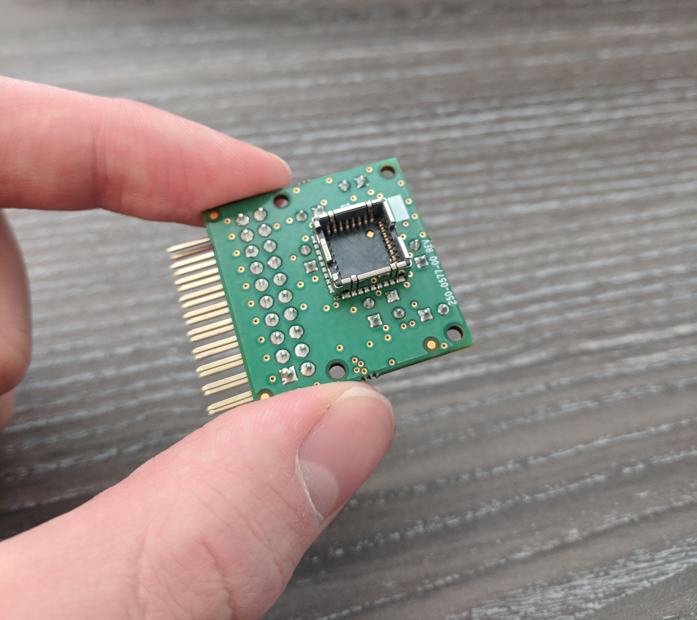
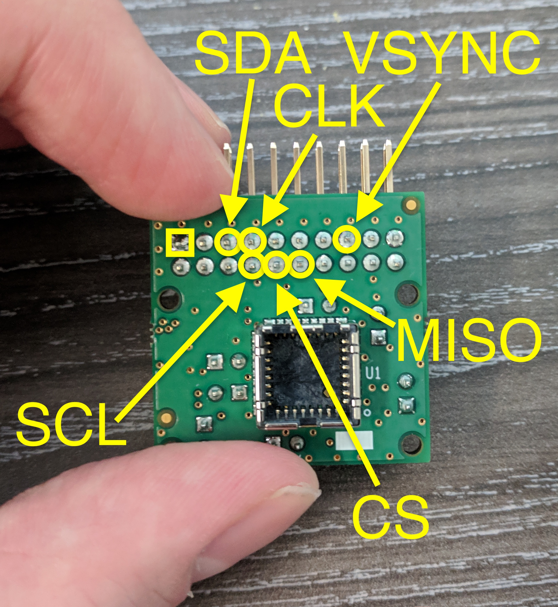
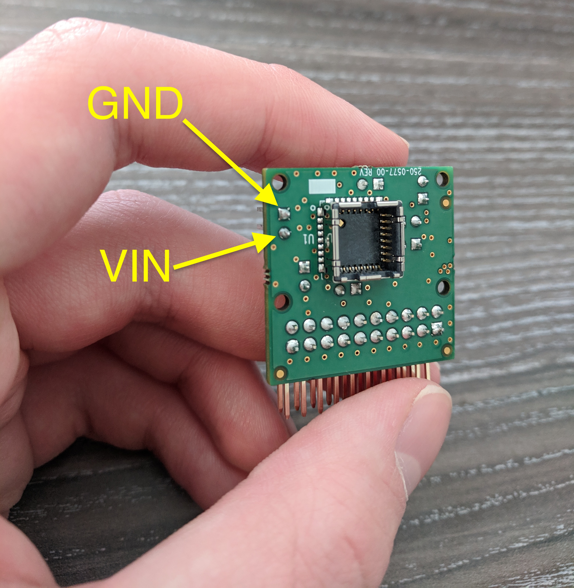

# Getting started with the RaspberryPi and Breakout board

## Disclaimer

This guide is for the newer breakout board (seen here). Earlier versions of the breakout board do not include `VSYNC`.



## Requirements

- A computer with the ability to read/write to MicroSD cards
  - A laptop running Ubuntu Linux 18.04 was used during this guide.
- A RaspberryPi 2/3/4
  - You can find them [here](https://www.digikey.com/products/en/development-boards-kits-programmers/evaluation-boards-embedded-mcu-dsp/786?k=Raspberry+Pi&k=&pkeyword=Raspberry+Pi&pv1742=726&sf=0&FV=ffe00312&quantity=&ColumnSort=0&page=1&pageSize=25).
  - A MicroUSB to USB-A cable.
  - A MicroSD card with at least 8GB of capacity.
    - As NOOBs is now deprecated, images can be downloaded from https://www.raspberrypi.com/software/operating-systems/
    - The "Legacy" OS version at time of writing is based on debian Buster.
    - The latest OS version at time of writing is based on debian Bullseye.
    - The instructions below were tested using manual installations of both the legacy and latest versions of
      Raspberry Pi OS Lite.
  - Labelled as __1__.
- A Lepton camera (2.X/3.X)
  - They can be found [here](https://www.digikey.com/products/en/sensors-transducers/image-sensors-camera/532?k=&pkeyword=&s=48165&s=64527&sf=0&FV=ffe00214&quantity=&ColumnSort=0&page=1&pageSize=25). For a higher resolution and telemetry data, it is recommended that you use a [Lepton 3.5](https://www.digikey.com/product-detail/en/flir/500-0771-01/500-0771-01-ND/7606616).
  - Labelled as __2__.
- A breakout board V2.0
  - Details on the board can be found [here](https://lepton.flir.com/hardware/#lepton-breakout-board-v20).
  - Labelled as __3__.
- Female-to-Female Jumper cables
  - Labelled as __4__.


## Hardware

### Attaching the breakout board to the RPi

You can find more information on the GPIO and the pinout of the RaspberryPi [here](https://www.raspberrypi.org/documentation/usage/gpio/). Attach (female-to-female) jumper wires between the following breakout board pins and the RaspberryPi board:



- (J2 Pin) -> (Proper name) -> (RPi connector pin)
- P8 -> SCL -> GPIO 3
- P5 -> SDA -> GPIO 2
- P12 -> MISO -> GPIO 9
- P7 -> CLK -> GPIO 11
- P10 -> CS -> GPIO 8
- P15 -> VSYNC -> GPIO 17

We will also need to connect power and ground to the board:



- (J3 Pin) -> (Proper name)
- P1 (__Square pin__) -> GROUND
- P2 -> VIN

### Setting up the MicroSD

You have two options for setting up the Micro SD:

- Use the Imager utility
- Install the image manually

Before beginning an install, prepare a micro SD card (WARNING: its contents will be overwritten) with a minimum capacity of 8 GB.

#### Imager utility

Insert the target micro SD card into the host machine's micro SD card reader slot.

Install the imager package available from https://www.raspberrypi.com/software/
onto a host computer system.

If installing the Ubuntu version, first check that the system is running the
latest stable version (20.04 at time of writing).  Open a terminal window, and
navigate to the directory containing the downloaded .deb file (try opening the
downloads folder from the web browser window to find the location).  From
there, run the following command:

```bash
$ sudo apt install ./imager*.deb
```

Enter the superuser password if prompted.  If all goes well, the imager
application can then be run:

```bash
$ rpi-imager
```

Select the version of Raspberry Pi OS from the "Operating System" control (the
"Raspberry Pi OS Lite" option from the "Raspberry Pi OS (other)" menu is the
fastest install option), and the SD card device from the "Storage" control, and
click "Write".  Enter the superuser password if prompted.

#### Manual install

Download one of the Raspberry Pi OS images from
https://www.raspberrypi.com/software/operating-systems/.

Follow the manual instructions for your host machine's platform here:
https://www.raspberrypi.com/documentation/computers/getting-started.html#downloading-an-image

In Linux, be careful to double-check which device files belong to the SD card,
since overwriting the wrong partition *will result in data loss*.

## Software

This guide describes how to cross-compile the lepton driver on a separate Linux development workstation (or a Linux VM
running on a development workstation), or alternatively on the Raspberry Pi itself.  Note that compiling a kernel
on a workstation is normally *far* faster than on the Raspberry Pi.

### Installing build tools for the Pi onto a Linux build host

When building the kernel directly on the Raspberry Pi, skip to the next
section.

Check https://www.raspberrypi.com/documentation/computers/linux_kernel.html#cross-compiling-the-kernel
for up-to-date instructions.  The kernel build steps described below in the "Build the Raspberry Pi kernel package"
section should be similar, except for building a Debian package containing the kernel image.

Perform this task on your Linux workstation (or Linux VM, if that's all you have available).
Pretty much any Linux distribution will work, but if you're using something other than Debian or Ubuntu
(or one of their derivatives, such as Mint) then you'll need to figure out local equivalents for
this suggested `apt` command to install build dependencies.

```bash
user@desktop:~ $ sudo apt install git bc bison flex libssl-dev make libc6-dev libncurses5-dev
```

Next, install the cross-compile toolchain.  The Ubuntu distribution conveniently provides a single package that will pull in the right dependencies:

```bash
user@desktop:~ $ sudo apt install crossbuild-essential-armhf
```

For other Linux distributions, go to https://github.com/abhiTronix/raspberry-pi-cross-compilers to download a pre-built toolchain for the appropriate Debian version running on the Raspberry Pi (the latest is "Bullseye" at time of writing), and follow the installation instructions.

### Collecting source code and build information

Some information needs to be collected from the Raspberry Pi before we begin.

Insert the programmed SD card into the Raspberry Pi, connect a USB keyboard, an
HDMI monitor (see
https://www.raspberrypi.com/documentation/computers/getting-started.html#connecting-a-display),
and a mouse (if a desktop OS is installed) to it, and power it on.

If the "Lite" version of Raspberry Pi OS is installed, the startup will result
in a text display and a `login:` prompt.  When the login prompt appears, supply
the default `pi` username and `raspberry` password.

Desktop versions of the Raspberry Pi OS will enter a graphical environment at
startup.  See
https://www.raspberrypi.com/documentation/computers/using_linux.html#terminal
if needed for help starting up a terminal window.

Connect the Raspberry Pi to a network, either with a network cable, or see
https://www.raspberrypi.com/documentation/computers/configuration.html#configuring-networking
for help setting up wifi.

At the shell prompt, run the following commands to update the system (this may
take a long time):

```bash
pi@raspberrypi:~ $ sudo apt update
pi@raspberrypi:~ $ sudo apt upgrade -y
```

When the upgrade finishes, reboot the Raspberry Pi:

```bash
pi@raspberrypi:~ $ sudo reboot
```

Once it has started up again, log in or open a terminal window as before.

Display the kernel package version:

```bash
pi@raspberrypi:~ $ dpkg -l | grep raspberrypi-kernel
ii  raspberrypi-kernel                   1:1.20211118-3                   armhf        Raspberry Pi bootloader
```

Keep track of the displayed version (`1:1.20211118-3` in this example), for checking out the matching tag of the
Linux source code.

Display the contents of `/proc/version' to find the Linux kernel version contained in the package:

```bash
pi@raspberrypi:~ $ cat /proc/version
Linux version 5.10.63-v7+ (dom@buildbot) (arm-linux-gnueabihf-gcc-8 (Ubuntu/Linaro 8.4.0-3ubuntu1) 8.4.0, GNU ld (GNU Binutils for Ubuntu) 2.34) #1488 SMP Thu Nov 18 16:14:44 GMT 2021
```

The version string `5.10.63-v7+` will be helpful when checking out the right version of the Lepton software.

(Optional) If enabling SSH access, it is a very good idea to change the default system password using the `passwd`
command, and keep a copy of the new password in a secure location.

```bash
pi@raspberrypi:~ $ passwd
```

(Optional) Set up the SSH secure shell server for remote access, if building the kernel on a desktop system:

```bash
pi@raspberrypi:~ $ sudo systemctl enable ssh
pi@raspberrypi:~ $ sudo systemctl start ssh
```

Find the Raspberry Pi's IP address for remote access using the `/sbin/ifconfig` command, or follow the instructions
found here:
https://www.raspberrypi.com/documentation/computers/remote-access.html#ip-address .
If using a desktop machine that supports avahi, the Pi can be connected to at `raspberrypi.local`.

Copy the kernel configuration file to /tmp:

```bash
pi@raspberrypi:~ $ sudo modprobe configs
pi@raspberrypi:~ $ cp /proc/config.gz /tmp
pi@raspberrypi:~ $ gunzip /tmp/config.gz
pi@raspberrypi:~ $ chmod 644 /tmp/config
```

On a desktop machine, start up a web browser and look at
https://github.com/raspberrypi/linux/tags to find a git tag corresponding to
the version of raspberrypi-kernel found above (`1:1.20211118-3` in the
example).  The 8-digit number is in fact a date encoded as YYYYMMDD, and it is
this date that should match the tag.  The tag matching package version
`1:1.20211118-3` is `stable_20211118`.

### Build the Raspberry Pi kernel package

This section may be performed on the Raspberry Pi itself, if it has at least 1
GB of RAM, or using a cross-compiler set up on a separate workstation as
described previously.  The unpacked kernel source will require over 1 GB of
free space.  An additional 1 GB or so will be needed for the kernel compile, so
overall there should be 2 GB or more free space on the machine used to build
the kernel.

If building on the Raspberry Pi, install kernel build pre-requisites using the following command:

```bash
pi@raspberrypi:~ $ sudo apt install git flex bison libssl-dev bc libncurses5-dev
```

Now, download the .zip file from github onto the build machine:

```bash
# Replace "stable_20211118" with the tag found on github, if different.
pi@raspberrypi:~ $ wget https://github.com/raspberrypi/linux/archive/refs/tags/stable_20211118.zip
pi@raspberrypi:~ $ unzip stable_20211118.zip
pi@raspberrypi:~ $ ln -s linux-stable_20211118 linux
pi@raspberrypi:~ $ cd linux
```

Copy the current kernel config:

```bash
# When compiling on the Raspberry Pi
pi@raspberrypi:~/linux $ cp /tmp/config .config

# When cross-compiling on a desktop machine
# Use the Pi's IP address in place of "raspberrypi.local" if avahi is not available
user@desktop:~/linux $ scp pi@raspberrypi.local:/tmp/config .config
```

If cross-compiling the kernel, set up environment variables used by the kernel build:

```bash
user@desktop:~/linux $ export ARCH=arm
user@desktop:~/linux $ export CROSS_COMPILE=arm-linux-gnueabihf-
```

(Optional) Modify the kernel config as needed with `make menuconfig`.  The following config options need to be set as follows to support the Lepton kernel module (the default Pi config had the correct settings at time of writing):
```
#CONFIG_CPU_IDLE is not set
CONFIG_DMA_ENGINE=y
CONFIG_VIDEOBUF2_CORE=m
CONFIG_VIDEOBUF2_MEMOPS=m
CONFIG_VIDEOBUF2_DMA_CONTIG=m
CONFIG_VIDEOBUF2_VMALLOC=m
```

Build the debian kernel binary package.
This took over 3 hours on a Raspberry Pi 3 model B, so be prepared for a long wait if compiling natively.  As a comparison, an Intel i7 8-core laptop can cross-compile the kernel source in less than 15 minutes:

```bash
pi@raspberrypi:~/linux $ make -j $(nproc) bindeb-pkg LOCALVERSION=-lepton
```

When the build succeeds, it will place the .deb files in the parent directory, which in this case is the user's home directory.

```bash
pi@raspberrypi:~/linux $ ls ..
linux
linux-5.10.63-v7-lepton_5.10.63-v7-lepton-1_armhf.buildinfo
linux-5.10.63-v7-lepton_5.10.63-v7-lepton-1_armhf.changes
linux-headers-5.10.63-v7-lepton_5.10.63-v7-lepton-1_armhf.deb
linux-image-5.10.63-v7-lepton_5.10.63-v7-lepton-1_armhf.deb
linux-libc-dev_5.10.63-v7-lepton-1_armhf.deb
```

If the kernel was cross-compiled on a separate machine, copy the kernel binary package to the Raspberry Pi:

```bash
user@desktop:~/linux $ scp ../linux-image*.deb pi@raspberrypi.local:
```

### Install the built kernel

Run the commands in this section on the Raspberry Pi.

Install the linux-image package:

```bash
pi@raspberrypi:~/linux $ cd
pi@raspberrypi:~ $ sudo dpkg -i linux-image*.deb
```

Create a separate overlay directory in /boot and copy the new kernel package's
overlays into it:

```bash
pi@raspberrypi:~ $ sudo mkdir /boot/linux_image_overlays
pi@raspberrypi:~ $ sudo cp /usr/lib/linux-image*/overlays/* /boot/linux_image_overlays
```

Edit the `/boot/config.txt` file to select the new kernel for the next boot:

```bash
pi@raspberrypi:~ $ sudo nano /boot/config.txt
```

The following new lines should be added (run `ls /boot` to find the exact file names for the installed kernel image and initrd, if the kernel version string differs):

```
kernel=vmlinuz-5.10.63-v7-lepton
initramfs initrd.img-5.10.63-v7-lepton followkernel
overlay_prefix=linux_image_overlays/  # Don't overlook the final '/' character.
```

Remove the '#' character from the first column of the following lines:

```
#dtparam=i2c_arm=on
#dtparam=i2s=on
#dtparam=spi=on
```

Save the changes to the `boot.config` file, reboot the Raspberry Pi, and log in once again.  If the kernel install was successful, you should see the new version in `/proc/version`:

```bash
pi@raspberrypi:~ $ cat /proc/version
Linux version 5.10.63-v7-lepton (flir@laptop) (arm-linux-gnueabihf-gcc (Ubuntu/Linaro 7.5.0-3ubuntu1~18.04) 7.5.0, GNU ld (GNU Binutils for Ubuntu) 2.30) #1 SMP Wed Jan 19 13:18:02 PST 2022
```

### Build Lepton source code on build host

The operations in this section need to run on the same host that built the Linux kernel, either the Raspberry Pi
itself, or cross-compiled on a desktop machine.

Clone the Lepton source code repository:

```bash
user@desktop:~ $ cd
user@desktop:~ $ git clone https://github.com/FLIR/Lepton.git
```

If not building on the Raspberry Pi, set up the cross-compile environment variables:

```bash
user@desktop:~ $ export ARCH=arm
user@desktop:~ $ export CROSS_COMPILE=arm-linux-gnueabihf-
```

The Lepton source code needs to be configured to match the kernel version
on your Pi. Use the pattern 'kernel-X.Y' below, where X.Y is a placeholder
for the first two parts of the actual version number. For instance, for the
kernel version reported earlier as "Linux version 5.10.63-v7+":

```bash
user@desktop:~ $ cd ~/Lepton/lepton_module
user@desktop:~/Lepton/lepton_module$ git checkout kernel-5.10
```

Be sure to use the version that matches your Pi kernel version, e.g. replace
"kernel-5.10" with "kernel-4.19" if your Pi is still running 4.19.

Compile the Lepton driver and its corresponding device tree overlay:

```bash
user@desktop:~/Lepton/lepton_module $ make -C ~/linux M=$PWD modules 
user@desktop:~/Lepton/lepton_module $ ~/linux/scripts/dtc/dtc flir-lepton-RPI.dts -o flir-lepton-RPI.dtbo
```

Ignore any warnings that come from compiling. 

Now compile the example lepton apps:
```bash
pi@raspberrypi:~/Lepton/lepton_module $ cd ~/Lepton
pi@raspberrypi:~/Lepton $ make
```

### Install Lepton software on Raspberry Pi

If the Lepton software was cross-compiled, copy the build directory to the Raspberry Pi:
```bash
user@desktop:~/Lepton $ cd
user@desktop:~ $ scp -r Lepton/ pi@raspberrypi.local:
```

Complete the install on the Raspberry Pi.

Install the user apps.

```bash
pi@raspberrypi:~ $ cd ~/Lepton
pi@raspberrypi:~/Lepton $ sudo cp lepton_control/rpi_vsync_app /usr/bin/
pi@raspberrypi:~/Lepton $ sudo cp lepton_data_collector/lepton_data_collector /usr/bin/
```

Install the kernel module.

```bash
pi@raspberrypi:~ $ cd ~/Lepton/lepton_module
pi@raspberrypi:~/Lepton/lepton_module $ sudo mkdir -p /lib/modules/$(uname -r)/extra
pi@raspberrypi:~/Lepton/lepton_module $ sudo cp lepton.ko /lib/modules/$(uname -r)/extra
pi@raspberrypi:~/Lepton/lepton_module $ sudo depmod -a
```

You will need to install the `.dtbo` file into the overlays folder.

```bash
pi@raspberrypi:~/rpi-lepton/lepton_module $ sudo cp flir-lepton-RPI.dtbo /boot/linux_image_overlays/
```

Specify the `i2c-dev` module as a dependency for the `lepton` module, by adding a new file in `/etc/modprobe.d`:

```bash
pi@raspberrypi:~/rpi-lepton/lepton_module $ echo "softdep lepton pre: i2c-dev" > /tmp/lepton.conf
pi@raspberrypi:~/rpi-lepton/lepton_module $ sudo mkdir -p /etc/modprobe.d
pi@raspberrypi:~/rpi-lepton/lepton_module $ sudo mv /tmp/lepton.conf /etc/modprobe.d/
```

Edit the `/boot/config.txt` file once more, and add the following line:

```bash
dtoverlay=flir-lepton-RPI
```

This will enable the overlay you just built. You will need to reboot the Raspberry Pi for the changes to `config.txt` to take effect.

```bash
pi@raspberrypi:~ $ sudo reboot
```

We should be set! Lets test if this worked.

## Testing the lepton camera on the Pi

Verify that the lepton is powered up and responding to i2c commands

```bash
pi@raspberrypi:~ $ sudo apt install i2c-tools
pi@raspberrypi:~ $ sudo modprobe i2c-dev
pi@raspberrypi:~ $ i2cdetect -r -y 1 0x2a 0x2a
```

If the lepton is responding, you will see

```
     0  1  2  3  4  5  6  7  8  9  a  b  c  d  e  f
00:                                                 
10:                                                 
20:                               2a                
30:                                                 
40:                                                 
50:                                                 
60:                                                 
70:                                                 
```

If you see dashes `--` in place of `2a`, there is a wiring or hardware problem
that needs to be resolved before going any further. Check the wiring and also
that the lepton is firmly seated in its socket.

Once everything is connected, run `rpi_vsync_app`:

```bash
pi@raspberrypi:~ $ rpi_vsync_app
```

The program should terminate quickly after performing various I2C commands.  Double-check the output for common
problems.  In the last six lines of output:
```
i2cdev_read_byte_data(rx_adr=0x25e80, rx_data=0x25670, rx_size=2) called.
Writing big-endian address 0x0028
Read back 2 bytes from I2C read:
bc 45   <-- if both values are 0, check that the Lepton hasn't popped out of its socket, and re-run i2detect.

LEP_GetOemGpioMode gpio_mode = 5 result = 0.
```

Check that the bytes read back are non-zero.  If all bytes read back are "0", or the error message "Remote I/O error" appears, power down the Raspberry Pi and try re-seating the Lepton in its socket, and double-check the I2C signal connections between the break-out board and the Raspberry Pi (specifically `SCL` and `SDA`).  Restart the Pi and try this step again.  The "Remote I/O error" messages may also appear if other I2C devices are sharing the I2C bus, in which case try removing other external I2C devices (if any) to find if that's the cause.

If the message "Bad file descriptor" is displayed, the `i2c-dev` module may not have been loaded.  Try running:
```bash
pi@raspberrypi:~ $ sudo modprobe i2c-dev
```

Re-run `rpi_vsync_app` and again check its output to make sure it succeeded.

You can use the `lepton_data_collector` application to capture grayscale images from the video device. 

- It consumes raw subframes via the V4L2 `/dev/videoN` device file (`/dev/video0` by default) and extracts the pixel data.
- For Lepton 3.X (with the command-line argument `-3`) it assembles four subframes into a single larger video frame.
  - If you are using a Lepton 2.X, use the command line argument `-2` instead.
- The image files are named after a prefix specified with the `-o` command-line argument, followed by a 6-digit (prefixed with 0's for smaller numbers) frame counter and a .gray extension.
- To reduce latency, it is a good idea to have it store frames into memory instead of to a flash device, so mount a tmpfs directory somewhere and prepend the path to the prefix.

Here is an example:

```bash
pi@raspberrypi:~ $ sudo su
root@raspberrypi:/home/pi# mkdir /tmp/capture
root@raspberrypi:/home/pi# mount -t tmpfs tmpfs /tmp/capture
root@raspberrypi:/home/pi# lepton_data_collector -3 -c 50 -o /tmp/capture/frame_
```

When complete, there should be 50 images captured from Lepton 3.X (about 5 seconds worth at ~9 fps) named `/tmp/capture/frame_000000.gray` through `/tmp/capture/frame_000049.gray`.

These images can be viewed on a Linux system using the ImageJ Java application, available from [here](https://imagej.nih.gov/ij/download.html). From the File menu, select `Import->Raw...`, and set image type to 16-bit unsigned along with the width and height (80x60 for Lepton 2.X, 160x120 for Lepton 3.X) in the dialog box that appears after selecting the file name.  The entire sequence can be placed into an image stack if the `Open all files in folder` checkbox is checked. Loading the files into an image stack makes it possible to produce a .avi movie from the frames using `File->Save As->AVI...` and setting the frame rate to 9 fps.

## Troubleshooting

### Before troubleshooting

Additional debug information can be retrieved by running:

```bash
pi@raspberrypi:~ $ dmesg | less
```

### "I just can't seem to get the module to load!"

There might have been either an issue when compiling or the dependencies weren't correctly found. Try installing the lepton module manually again:

```bash
pi@raspberrypi:~ $ sudo modprobe lepton
```

If the lepton module can't be found, try running the following command to build the dependencies:

```bash
pi@raspberrypi:~ $ sudo depmod -a
```

Now, run `modprobe` again.
